# Buildings

---

Buildings are player-made structures that generate materials. Before a building can be used, it must be submitted in the building submissions channel, where an admin will review it, approve it, and assign its tier.

Buildings come in two types: passive and active.

Passive buildings operate automatically without any input, sending their output straight to the town's income. Some also provide extra functionality, for example ports let you teleport to other ports within range.

Active buildings require an input to run, and their finished output drops on the ground instead of being collected automatically. Because their progress is visible on the map, other players may attempt to steal the output.

Every building has a tier from 1 to 3, with the effects of each tier varying by building type (listed below). Regardless of a buildings tier, it will take one hour to produce its materials.

 

# Passive buildings

---

## Farm
Farms produce food.

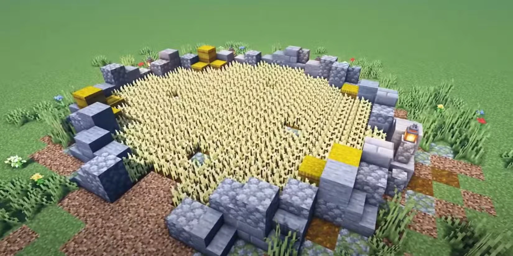

### Tier 1
* 64 Wheat
* 64 Carrots
   
   
   

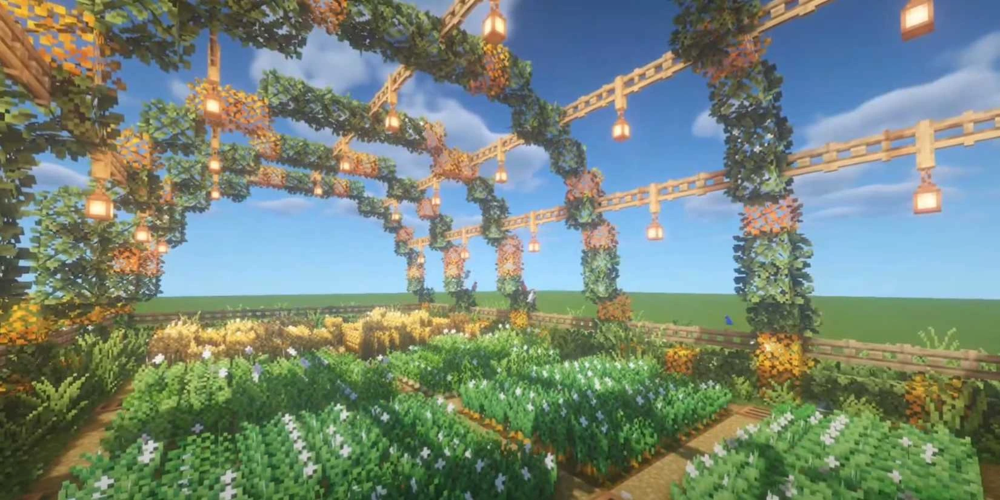

### Tier 2
* 64 Wheat
* 64 Carrots
* 64 Beef
* 64 Pork
   

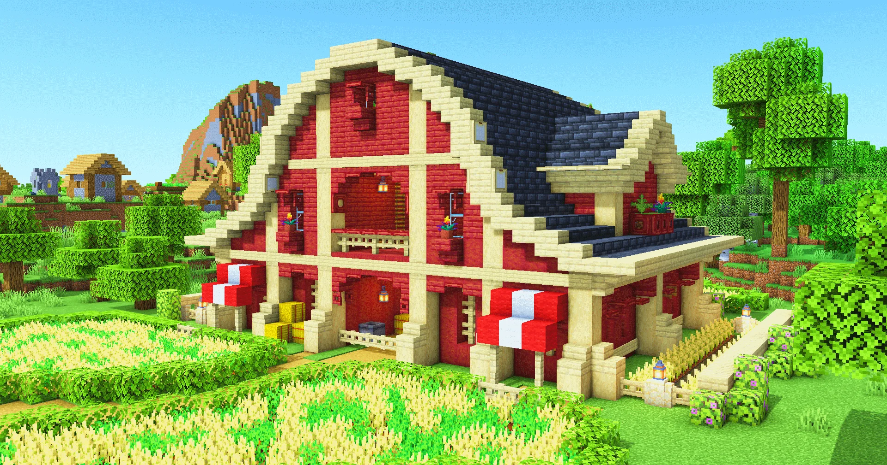

### Tier 3
* 128 Wheat
* 128 Carrots
* 128 Beef
* 128 Pork
   

---

## Port
Ports produce fish and allow you to teleport to an allied town's port if it is close enough. Requires territory tier 1.

Ports must be built within 2 chunks of the territories edge:
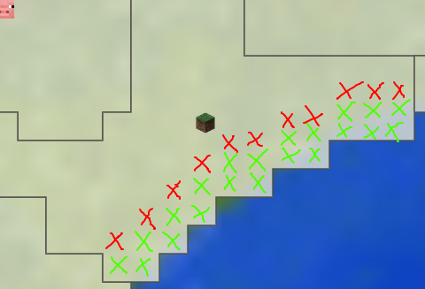

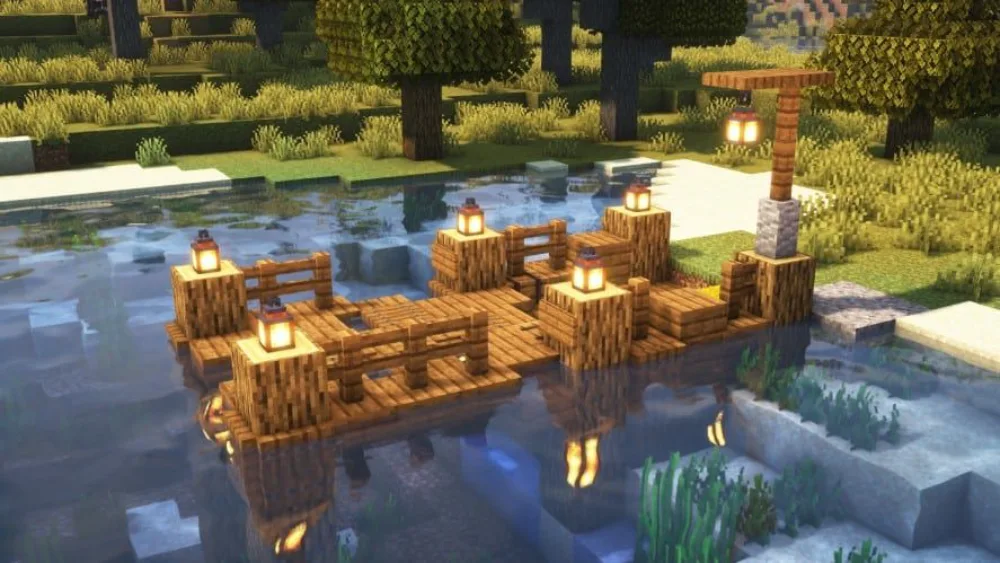

### Tier 1
* 2500 block range
* 16 fish
 
 
 

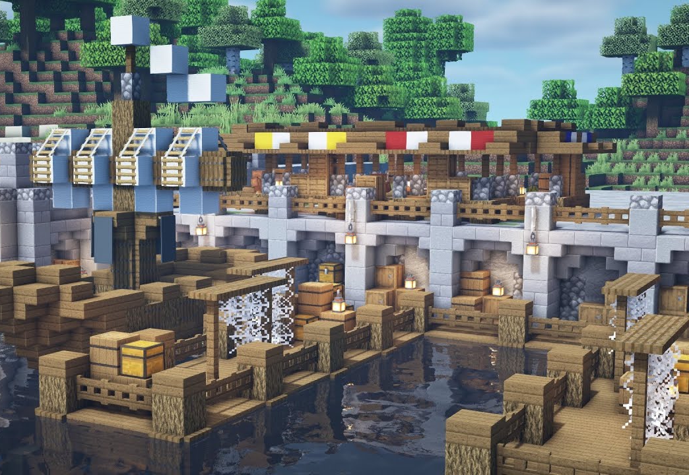

### Tier 2
* 5000 block range
* 32 fish
 
 
 

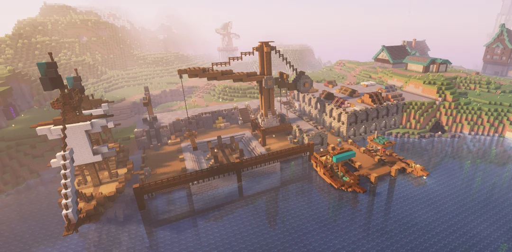

### Tier 3
* 10000 block range
* 64 fish
 
 
 
---

## Train station
Train stations produce small amounts of coal and oil. Rails can be built connecting railways to allow fast travel between them. Requires territory tier 1.

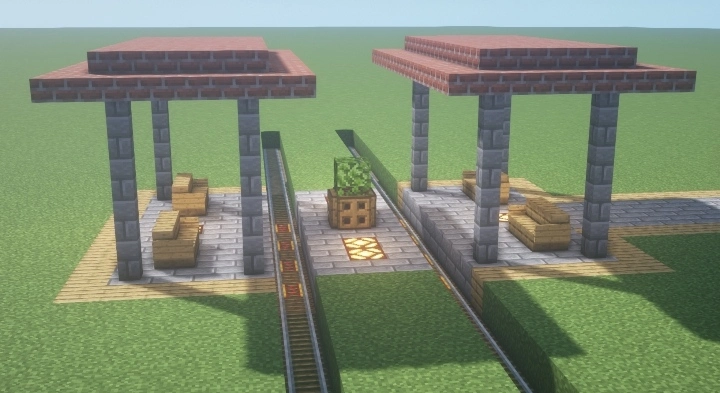

### Tier 1
* 25 bps
* 8 Coal
* 4 Oil
 
 

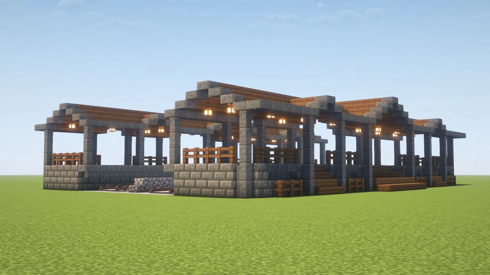

### Tier 2
* 50 bps
* 16 Coal
* 8 Oil
 
 

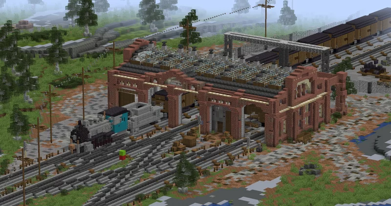

### Tier 3
* 100 bps
* 32 Coal
* 16 Oil
 
 
---

## Oil rig
Oil rigs produce oil. Requires territory tier 2.

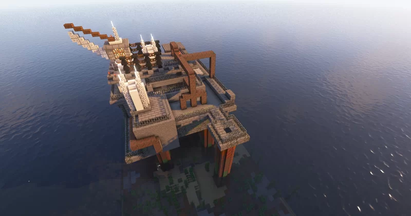

### Tier 1
* 32 Oil
 
 
 
 

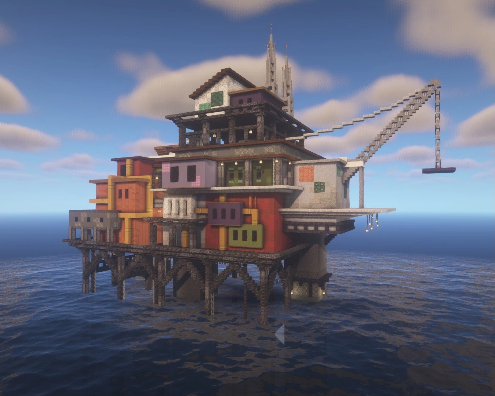

### Tier 2
* 64 oil
 
 
 
 

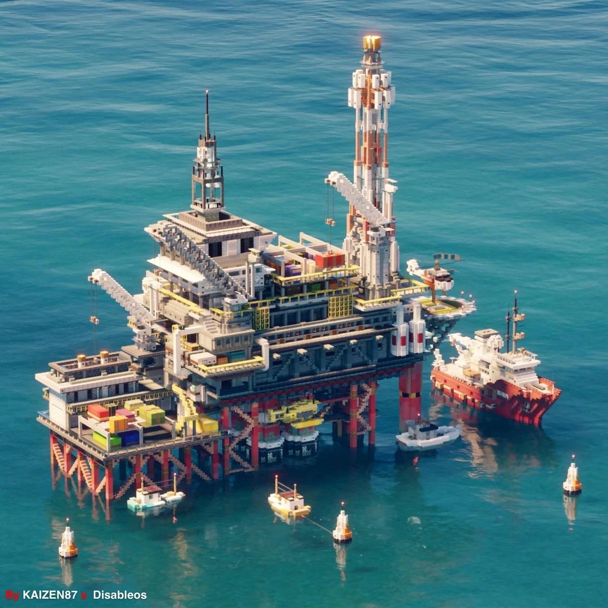

### Tier 3
* 128 Oil
 
 
 
 

## Active Buildings

---
## Oil refinery
Oil refineries convert oil into useful fuel. Requires territory tier 3.

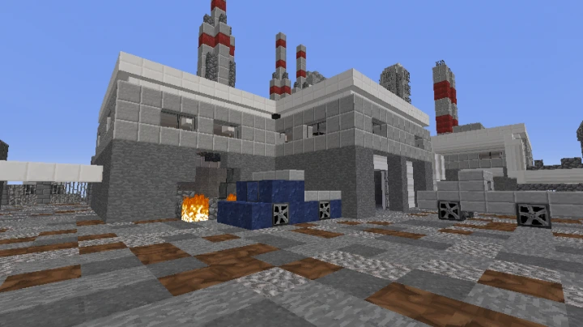

### Tier 1
* 4 oil -> 2 fuel
 
 
 
 

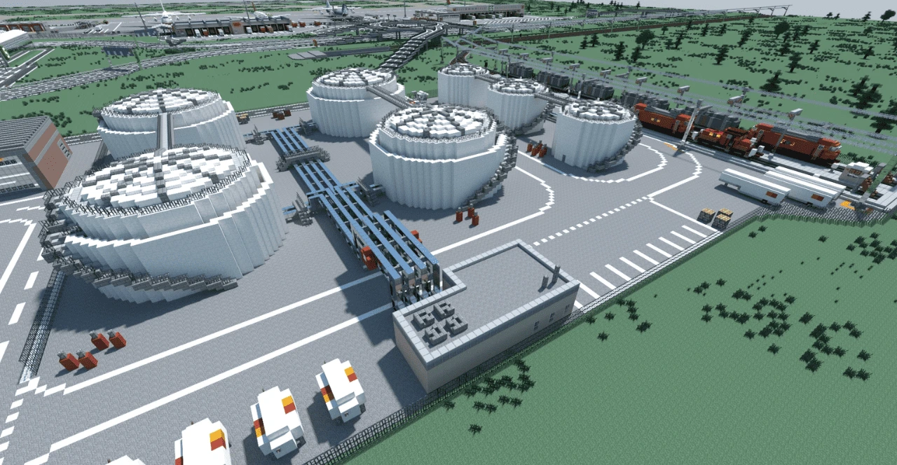

### Tier 2
* 8 oil -> 6 fuel
 
 
 
 

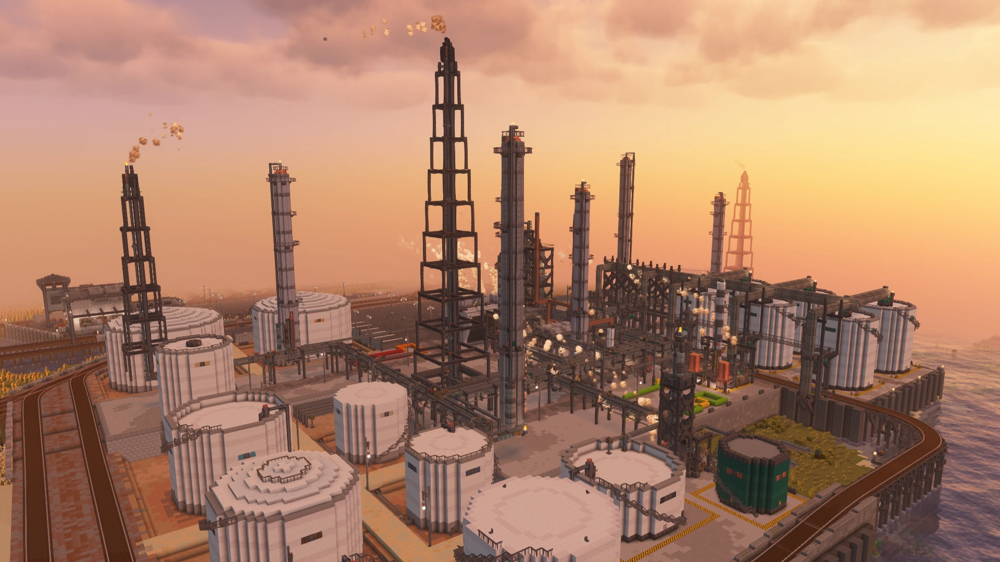

### Tier 3
* 20 oil -> 18 fuel
 
 
 
 

---
## Land factory
Land factories convert oil into various land vehicles. Requires territory tier 3.

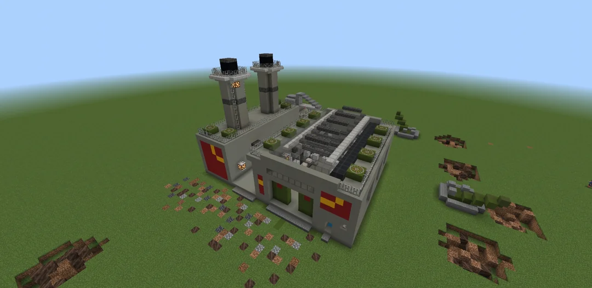

### Tier 1
* 16 oil -> Truck
 
 
 
 

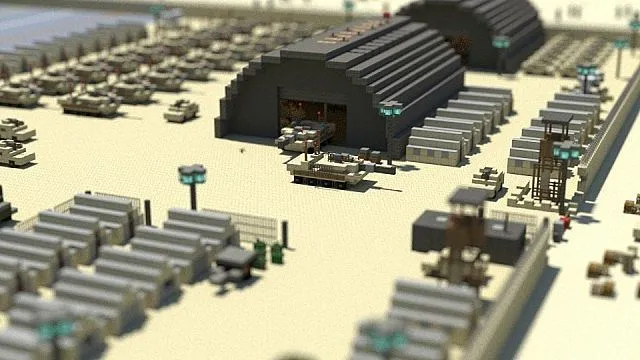

### Tier 2
* 16 oil -> Truck

**or**
* 32 oil -> T-62

**or**
* 48 oil -> M60
 
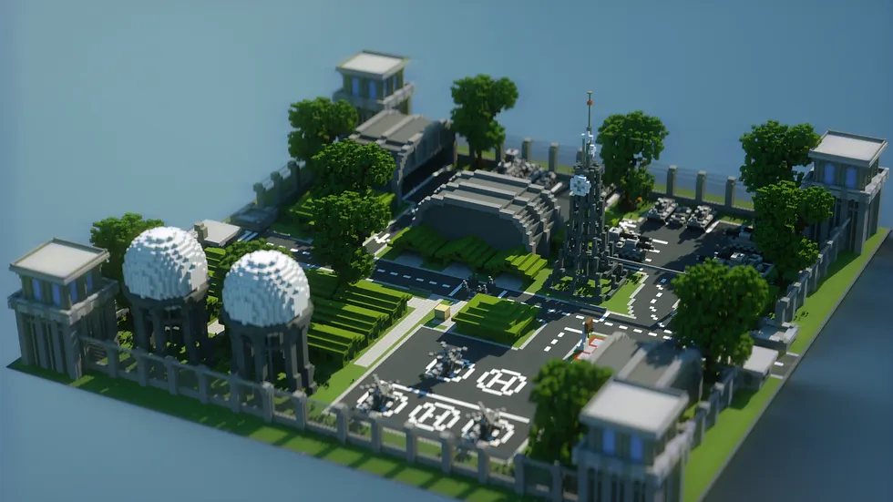

### Tier 3
* 8 oil -> Truck

**or**
* 32 oil -> T-72B

**or**
* 48 oil -> M1A1 Abrams

---